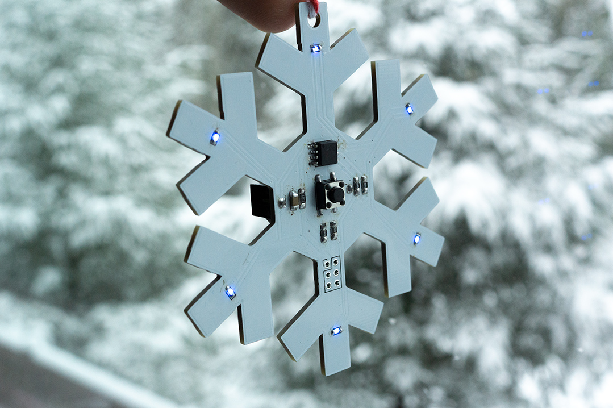
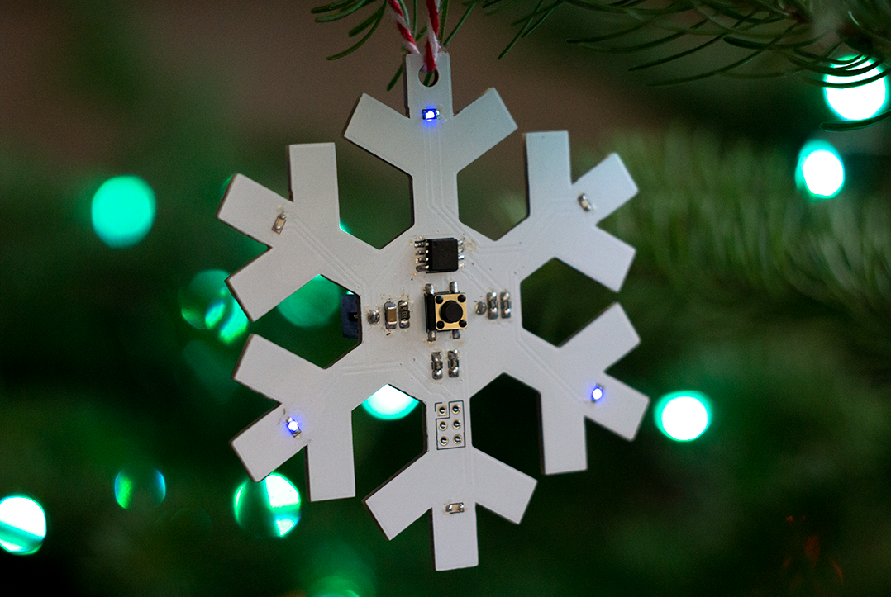
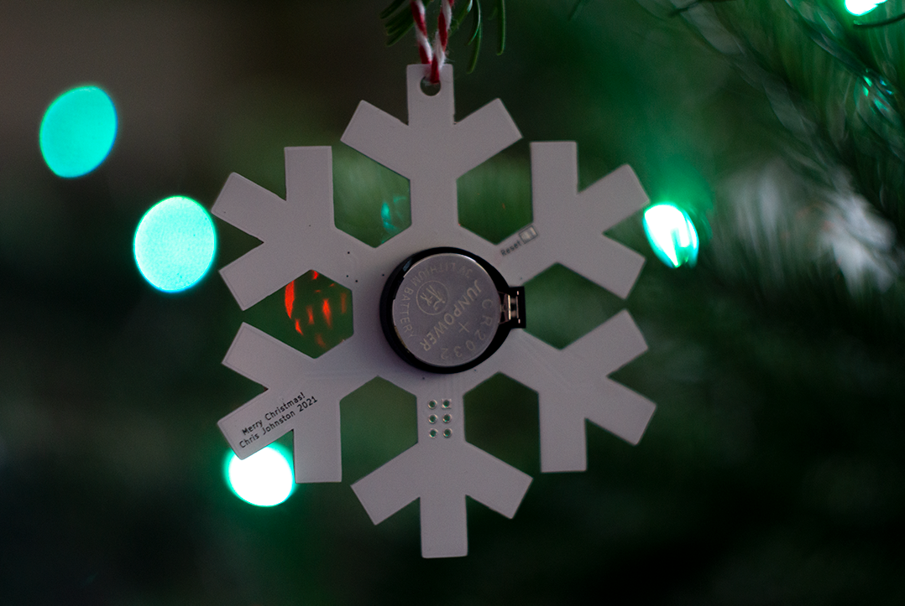
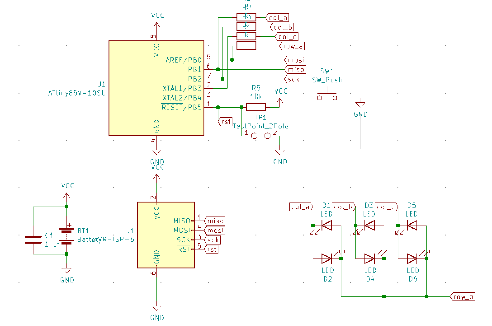
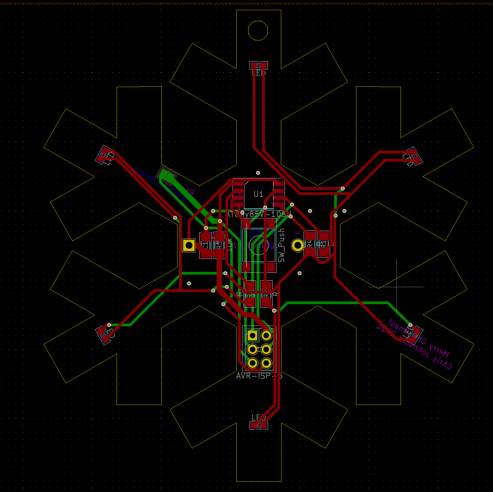

# Snowflake-Ornament

A snowflake shaped Xmas ornament with blinking LEDs.

This uses an ATTiny85 to drive 6 blue LEDs which are multiplexed.
There's a button on the front which is used to toggle display modes
and sleep.

When sleeping, the ornament uses about 200 microamps of current, little enough to run
off of a coin cell battery for about 1000 hours (in reality, probably less. I don't know, I didn't measure it)! While running, it uses about 2 milliamps,
which could last for about 120 hours.

The part was designed using KiCad. The shape of the PCB was generated with
[svg2mod]. The [outline of the board was modified from Wikipedia (Public Domain)](https://en.wikipedia.org/wiki/File:Snow_flake.svg), I added a hexagon in the
center to make room for the button, ATTiny85, and battery.

[svg2mod]: https://github.com/svg2mod/svg2mod

## Requirements

I use [damellis/attiny] for ATTiny85 support in the Arduino editor (via the VSCode extension).

[damellis/attiny]: https://github.com/damellis/attiny

## Bill of Materials

| Reference | Item |
| --------- | ---- |
| U1 | Attiny85V |
| R1, R2, R3, R4 | 50 ohm 1206 resistor |
| R5 | 10k 1206 resistor |
| C1 | 1 uf 1206 capacitor |
| D1 - D6 | 0603 LED |
| SW1 | 6x6mm SMD Pushbutton |
| BT1 | CR2023 Battery Holder |

Yes, the traces aren't parallel to the edges of the board, and yes it bugs me too.

